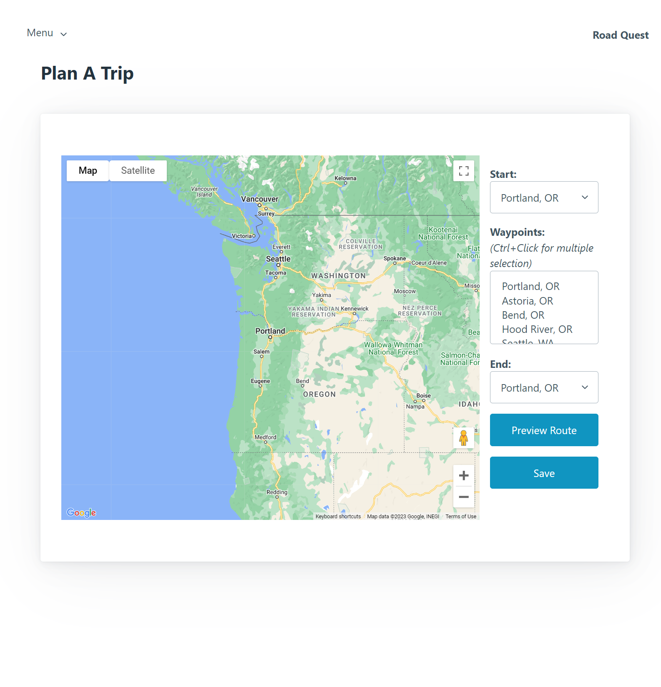

# Road_Quest


## Description
As an avid traveler, I want to be able to create a road trip route in order to share with friends, so that I can update them and receive stop suggestions. This webpage allows users to create and share roadtrip routes so that other users can look at your route and suggest stoppping points along the way.
## Table of Contents:
* [Installation](#installation)
* [Usage](#usage)
* [License](#license)
* [Contributing](#contributing)
* [Credits](#credits)
* [Questions](#questions)
### Installation
```bash
git clone https://github.com/savannahvel/Road_Quest.git
```
```bash
npm i
 ```
### Usage
Login User Information: 
Email: 123@gmail.com
Password: password12345
https://limitless-sea-80342.herokuapp.com/

### License
[MIT License](https://opensource.org/licenses/MIT)
### Contributing
1. **Fork** the repo on GitHub.
2. **Clone** the project to your own machine.
3. **Commit** changes to your own branch.
4. **Push** your work back up to your fork.
5. Submit a **Pull request** so that your changes can reviewed.
### Credits
- Savannah Vel (Project manager) https://github.com/savannahvel
- Peter Atras https://github.com/poprit77
- Matthew Bowman https://github.com/Mbowman1221
- Carson Garbe https://github.com/carsongarbe
- Sam Jensen https://github.com/Samualjensen

Image by <a href="https://www.freepik.com/free-vector/flat-travel-background_3765285.htm#query=road%20trip&position=19&from_view=keyword&track=sph">Freepik</a>

Thank you to <a href="https://www.google.com/maps/">Google Maps</a> for the use of the API.
### Questions
